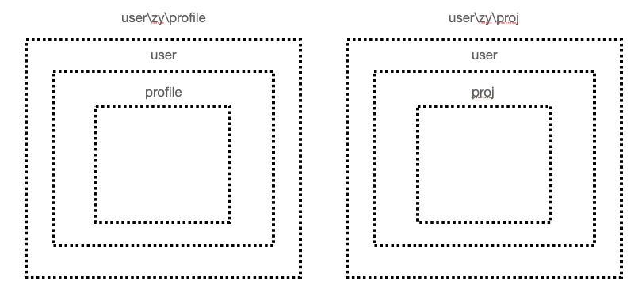

# Router官方文档复盘

------

## 基础

------

### 起步

用 Vue.js + Vue Router 创建单页应用，将组件 (components) 映射到路由 (routes)，然后告诉 Vue Router 在哪里渲染它们。

```html
# HTML
<script src="https://unpkg.com/vue/dist/vue.js"></script>
<script src="https://unpkg.com/vue-router/dist/vue-router.js"></script>

<div id="app">
  <h1>Hello zs!</h1>
  <p>
    <!-- 使用 router-link 组件来导航. -->
    <!-- 通过传入 `to` 属性指定链接. -->
    <!-- <router-link> 默认会被渲染成一个 `<a>` 标签 -->
    <router-link to="/zy">Go to Zy</router-link>
    <router-link to="/zs">Go to Zs</router-link>
  </p>
  <!-- 路由出口 -->
  <!-- 路由匹配到的组件将渲染在这里 -->
  <router-view></router-view>
</div>
```

```js
// 0. 如果使用模块化机制编程，导入Vue和VueRouter，要调用 Vue.use(VueRouter) !!!

// 1. 定义 (路由) 组件
// 可以从其他文件 import 进来
const Zy = { template: '<div>Zy</div>' }
const Zs = { template: '<div>Zs</div>' }

// 2. 定义路由规则
// 每个路由应该映射一个组件 其中 "component" 可以是通过 Vue.extend() 创建的组件构造器 或者 只是一个组件配置对象
const routes = [
  { path: '/zy', component: Zy },
  { path: '/zs', component: Zs }
]

// 3. 创建 router 实例,然后传 `routes` 配置
// 还可以传别的配置参数
const router = new VueRouter({
  routes // (缩写) 相当于 routes: routes
})
/* const router = new VueRouter({
  routes = [
  { path: '/zy', component: Zy },
  { path: '/zs', component: Zs }
]
}) */

// 4. 创建和挂载根实例 => 通过 router 配置参数注入路由，从而让整个应用都有路由功能
const app = new Vue({
  router
}).$mount('#app')

// 现在应用已启动
```

通过注入路由器，我们可以在任何组件内通过 `this.$router` 访问路由器，也可以通过 `this.$route` 访问当前路由：

```js
// Home.vue
export default {
  computed: {
    username() {
      return this.$route.params.username
    }
  },
  methods: {
    goBack() {
      window.history.length > 1 ? this.$router.go(-1) : this.$router.push('/')
    }
  }
}
```

------

### 动态路由匹配

某种模式匹配到的所有路由，全都映射到同个组件。例如，有一个 `User` 组件，对于所有 ID 各不相同的用户，都要使用这个组件来渲染。那么，我们可以在 `vue-router` 的路由路径中使用“动态路径参数”(dynamic segment) 来达到这个效果：

```js
const User = {
  template: '<div>User</div>'
}

const router = new VueRouter({
  routes: [
    // 动态路径参数 以冒号开头
    { path: '/user/:usr', component: User }
  ]
})
// 现在像 /user/zy 和 /user/zs 都将映射到相同的路由
```

一个“路径参数”使用冒号 `:` 标记。当匹配到一个路由时，参数值会被设置到 `this.$route.params`，可以在每个组件内使用。于是，我们可以更新 `User` 的模板，输出当前用户的 ID：

```js
const User = {
  template: '<div>User {{ $route.params.usr }}</div>'
}
// User zy \ User zs
```

一个路由中设置多段“路径参数”，对应的值都会设置到 `$route.params` 中。

| 模式                     | 匹配路径                    | $route.params                             |
| ------------------------ | --------------------------- | ----------------------------------------- |
| /user/:username          | /user/zairesinatra          | `{ username: 'zairesinatra' }`            |
| /user/:username/post/:bd | /user/zairesinatra/post/422 | `{ username: 'zairesinatra', bd: '422' }` |

除了 `$route.params` 外，`$route` 对象还提供了其它有用的信息，例如，`$route.query` (如果 URL 中有查询参数)、`$route.hash` 等等。

------

### 嵌套路由

URL 中各段动态路径按某种结构对应嵌套的各层组件。



------

## 总结

### `$router` 和 `$route` 的区别

`router` 为 `VueRouter` 的实例，相当于一个全局的路由器对象，里面含有很多属性和子对象（**在 Vue 实例内部，可以通过 `$router` 访问路由实例**）。如：跳转链接就可以用编程式导航 `this.$router.push(...)` 原理与声明式导航 `<router-link :to="...">` 跳转类似。（细节参考：https://router.vuejs.org/zh/guide/essentials/navigation.html#router-push-location-oncomplete-onabort）

| 编程式导航                                        | 描述                                                         | 参数                                 |
| ------------------------------------------------- | ------------------------------------------------------------ | ------------------------------------ |
| `router.push(location, onComplete?, onAbort?)`    | 使用 `router.push` 方法。这个方法会向 history 栈添加一个新的记录，所以，当用户点击浏览器后退按钮时，则回到之前的 URL | 字符串、对象、命名的路由、带查询参数 |
| `router.replace(location, onComplete?, onAbort?)` | 不会向 history 添加新记录，而是跟它的方法名一样 —— 替换掉当前的 history 记录 | ...                                  |
| `router.go(n)`                                    | 参数是一个整数，意思是在 history 记录中向前或者后退多少步    | 类似 `window.history.go(n)`          |

| 声明式                    | 编程式             |
| ------------------------- | ------------------ |
| `<router-link :to="...">` | `router.push(...)` |

路由对象表示当前激活的路由的状态信息，包含了当前 URL 解析得到的信息，还有 URL 匹配到的**路由记录 (route records)**。路由对象经导航成功都会产生新的不可变对象。

常见出没点：组件内 `this.$route`、`$route`观察者回调、`router.match(location)`返回值、`router.beforeEach(to, from, next)`参数、`scrollBehavior`滚动行为方法参数

