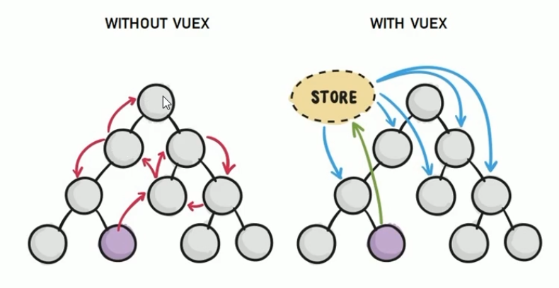

# VUEX

------

基本使用步骤（配置）、核心概念、实现业务功能

## 初识：

### 组件之间共享数据的方式（<u>小范围</u>）：

- 父向子组件传递数据：`v-bind` 属性绑定
- 子组件向父组件传值： `v-on` 事件绑定
- 兄弟组件之间数据共享： `EventBus` => `$on` 注册事件-接受数据的组件、`$emit` 发送数据的组件

### Vuex：

- 实现组件全局状态（数据）管理的一种机制（方案），可以实现组件之间的数据共享。（Vuex中的数据也称为 **状态**、全局数组 ）

- 大范围、频繁的数据共享 => VUEX 
- 集中管理共享数据，易于开发与后期维护；高效数据共享，提高开发效率；存储在 vuex 中的数据是**响应式**的，实时保持**数据与页面的同步**
- 对于组件间共享的数据存储在 vuex 中；在组件中的私有数据，依旧存储在组件自身的 `data` 中即可

