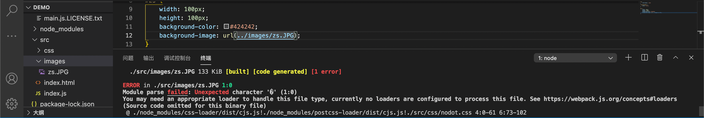

# WEBPACK

------

## 重点

- 模块化规范
- 使用 WEBPACK
- 使用 Vue 单文件组件
- 使用 Vue 脚手架创建企业级项目
- 使用 ELEMENT-UI

## 模块化开发

主要问题 => 命名冲突、文件依赖（`.js`文件之间无法实现相互的引用）

模块化即把单独的功能封装在模块中，虽模块之间相互隔离却可通过特定的接口公开内部成员以及依赖别的模块

### 浏览器端与服务器端模块化规范

- AMD =>` Require.js` 
- CMD => `Sea.js`
- CommonJS => 模块分为单文件模块和包、暴露成员可用`module.exports`、`exports`、模块成员导入可用`require('模块标识符')`
- 大一统的 **ES6 模块化开发规范** => 每个 `js` 文件是一个独立的模块、导入成员使用 `import` 关键字、导入成员使用 `import` 关键字、暴露成员使用 `export` 关键字 

在 Node.js 中通过 Babel 体验 ES6模块化（Babel-语法转换工具-高级兼容性的JavaScript代码转换为低级没有兼容性的代码）

- ```zsh
  # 安装相关依赖包
  npm install --save-dev @babel/core @babel/cli @babel/preset-env @babel/node
  ```

- ```zsh
  npm install --save @babel/polyfill
  ```

- ```zsh
  # 项目跟踪目录创建文件
  babel.config.js
  ```

- ```js
  // babel.config.js文件内容
  const preset = [ // 语法转换的数组
    ["@babel/env", { // 语法转换插件
      targets: {
        edge: "17",
        firefox: "60",
        chrome: "67",
        safari: "11.1"
      }
    }]
  ];
  module.exports = { presets };
  ```

- ```zsh
  # 执行代码-babel跑起来-根据指定的配置信息做代码转换
  npx babel-node index.js
  # 详见文末补充说明
  ```

### ES6模块化

#### 默认导出与导入

- 默认导出与导入

```js
export default { 导出默认成员 }
```

```js
import 接受名称 from '模块标识符'
```

注意

-  => 每个模块仅唯一的一次 `export default` 否则报错-```SyntaxError: Unexpected token 'export'```
-  => 同时未使用 `export default` 则其他文件导入时会出现空对象 `{}`

#### 按需导出与导入

- 按需导出与导入

```js
export let usr = "xxxzzzyyy"
```

```js
import { usr } from '模块标识符' // 这里的按需导入名称不能乱写-与导出一一对应
```

<span style="color:red">在一个模块中仅一次默认导出，而可以无数次按需导出</span>

#### 直接导入并执行模块代码

- 直接导入并执行模块代码（仅执行、不需得到模块向外暴露的成员）

```js
// 直接导入并执行模块代码
import './ES6模块化基本语法.js'
// 当前文件模块
for (let i = 0; i < 3; i++) {
    console.log(i);
}
```

## WEBPACK

### 当前 Web 开发面临困境

文件依赖错综复杂、静态资源请求效率低、模块化支持不友好、浏览器对高级 JavaScript 特性兼容性较低

### webpack 基本使用

#### 隔行变色demo

```js
// 创建新空白目录行 初始化包管理配置文件
npm init -y
```

```js
// 新建 src 源代码目录
```

```js
// src 中新建 index.html 首页
```

```js
// 初始化首页基本结构
```

```js
// 运行 npm install jquery -s 命令安装jquery
```

```js
// 模块化形式实现列表隔行变色
```

#### 项目中使用webpack

```zsh
# 安装 webpack 相关包
npm install webpack webpack-cli -D
```

```js
// 项目根目录创建 webpack.config.js 的 webpack 配置文件
module.exports = {
  mode: 'development' // mode 用来指定构建模式 - development 不压缩与混淆
  // production 转换的代码会进行压缩
}
```

```js
// 在 package.json 配置文件的 script 节点下新增 dev 脚本如下
"script" : {
  "dev": "webpack" // script 节点下的脚本可通过 npm run 执行
}
```

```zsh
# 终端运行命令启动项目 webpack 打包
npm run dev
```

### 浅谈 webpack

https://webpack.docschina.org/concepts/ -- **webpack** 是一个用于现代 JavaScript 应用程序的 *静态模块打包工具*

从 v4.0.0 开始，**webpack 可以不用再引入一个配置文件**来打包项目，然而它仍然有着高度可配置性满足需求。

#### **核心概念**

- [入口(entry)](https://webpack.docschina.org/concepts/#entry)

**入口起点** 指示 webpack 应该使用哪个模块，来作为构建其内部 [依赖图(dependency graph)](https://webpack.docschina.org/concepts/dependency-graph/) 的开始。进入入口起点后，webpack 会找出有哪些模块和库是入口起点（直接和间接）依赖的。

**默认值**是 `./src/index.js`，但你可以通过在自己创建的 `webpack.config.js` 文件中配置 `entry` 属性，来指定一个（或多个）不同的入口起点。

```js
module.exports = {
  entry: './path/to/my/entry/file.js',
};
```

- [输出(output)](https://webpack.docschina.org/concepts/#output)

**output** 属性告诉 webpack 在哪里输出它所创建的 *bundle*，以及如何命名这些文件。主要输出文件的默认值是 `./dist/main.js`，其他生成文件默认放置在 `./dist` 文件夹中。

可以通过在配置中指定一个 `output` 字段，来配置这些处理过程：

```javascript
const path = require('path');

module.exports = {
  entry: './path/to/my/entry/file.js',
  output: {
    path: path.resolve(__dirname, 'dist'),
    filename: 'my-first-webpack.bundle.js',
  },
};
```

在上面的示例中，我们通过 `output.filename` 和 `output.path` 属性，来告诉 webpack bundle 的名称，以及我们想要 bundle 生成到哪里。导入一个Node.js 核心模块 path 模块用于操作文件路径。

- [loader](https://webpack.docschina.org/concepts/#loaders)
- [插件(plugin)](https://webpack.docschina.org/concepts/#plugins)
- [模式(mode)](https://webpack.docschina.org/concepts/#mode)
- [浏览器兼容性(browser compatibility)](https://webpack.docschina.org/concepts/#browser-compatibility)
- [环境(environment)](https://webpack.docschina.org/concepts/#environment)

#### 配置 `webpack` 自动打包功能

类似 `nodemon` 修改内容后不会自动渲染，故为了让 `index` 最新代码生效，需要配置 `webpack` 自动打包功能

`webpack-dev-server` 会启动一个实时打包的服务器、监听代码变化

`webpack-dev-server` 打包生成的输出文件存放在内存中，并 serve 在 server 上

`webpack-dev-server` 为你提供了一个简单的 web server，并且具有 live reloading(实时重新加载) 功能。设置如下：

- ```zsh
  # 安装自动打包工具
  npm install webpack-dev-server -D
  # npm install --save-dev webpack-dev-server
  ```

- ```zsh
  # 修改 package.json 中 script
  # 添加一个可以直接运行 dev server 的 script：
  "script": {
  	"zsdev":"webpack serve --open Chrome" // script下的脚本通过 npm run 运行
  	# "start": "webpack serve --open"
  }
  ```

- ```js
  // 将 index.html 中 script 脚本引用路径 src ,修改为 /bundle.js
  ```

- ```zsh
  # 重新进行项目打包
  npm run zsdev
  ```

- ```js
  // 浏览器中访问地址即可
  ```

详细请参见--https://webpack.docschina.org/guides/development/

#### 配置 `html-webpack-plugin` 生成预览页面-不需要经过根路径

浏览器访问一层路径的时候，若是这一层路径中包括 `index.html` 则默认会打开这个首页

如何将 SRC 中的 `index.html` 复制到首页 => `html-webpack-plugin`

- ```zsh
  # 安装 npm 包
  npm install html-webpack-plugin -D
  ```

- ```js
  // 修改 webpack.config.js 文件头部区域,添加如下配置
  // 导入生成预览页面插件
  const HtmlWebpackPlugin = require('html-webpack-plugin')
  const htmlplugin = new HtmlWebpackPlugin({
    template: './src/index.html', // 指定要用的模板文件
    filename: 'index.html' // 指定要生成的文件名称,将该文件存于内存中,目录不显示
  })
  ```

- ```js
  // 修改 webpack.config.js 文件中向外暴露的配置文件,新增如下配置节点
  module.exports = {
    plugins: [ htmlPlugin ] // plugins 数组是 webpack 打包期间会用到的插件列表
  }
  ```

#### 配置自动打包相关参数

```js
// --open 打包完成自动打开浏览器页面
// --host 配置 IP 地址
// --port 配置端口
"dk": "webpack serve --open firefox --host 127.0.0.1 --port 8888"
```

------

### webpack 中的加载器

#### 通过 loader 打包非 JavaScript 内容

webpack 默认打包处理 `.js` 后缀结尾的模块，其他非 `.js` 后缀名结尾的模块处理不了，此时需要调用 loader 加载器

- less-loader => `.less` 相关文件
- sass-loader => `.sass` 相关文件
- url-loader => 打包处理 css 中与 url 路径相关文件

1. 打包处理 CSS 文件

```zsh
# 打包处理 css 文件
npm i style-loader css-loader -D
```

```js
// 配置 webpack.config.js 中 新增 module 的 rules 数组
module: {
  rules: [
    // test 表示匹配文件类型、use 表示调用的 loader
    // use 中指定的 loader 顺序是固定的 => 必先 style-loader 再 css-loader!!!
    // 多个 loader 调用顺序是从后往前调用 => css -> style
    { test:/\.css$/, use:['style-loader', 'css-loader'] }
  ]
}
```

2. 打包处理 less 文件

```zsh
# 安装 less 依赖包
# less 是 less-loader 内置依赖包 => less-loader 正常工作必须内置 less 
npm i less-loader less -D
```

```js
// webpack.config.js 的 module 对象中 rules 数组增加 loader 规则
module: {
  rules: [
    { test:/\.less$/, use:['style-loader', 'css-loader', 'less-loader'] }
  ]
}
```

3. 打包处理 scss 文件

sass 与 less 一样都是样式的预编译语言，不同项目可能选择不同语言

注意一下这里文件名后缀是 `.scss` ，而安装包是 scss

```zsh
npm i sass-loader node-sass -D
```

```js
// 新增 loader 规则
module: {
	rules: [
		{ test: /\.scss$/, use: [ 'style-loader', 'css-loader', 'sass-loader' ] }
	]
}
```

4. 配置 postCSS 自动添加 CSS 的兼容前缀

例如直接在 `.html`  文件中写入 `placeholder` 属性

```zsh
npm i postcss-loader autoprefixer -D
```

```js
// 项目根目录创建 postcss 配置文件 postcss.config.js 初始化配置
const autoprefixer = require('autoprefixer')
// 插件安装与暴露
module.exports = {
  plugins: [ autoprefixer ] // 挂载插件
}
```

```js
// 修改 webpack.config.js 中 module 里 rules 数组的 css 配置loader
module: {
  rules: [
    { test: /\.css$/, use: ['style-loader', 'css-loader', 'postcss-loader'] }
  ]
}
```

5. 打包样式表中图片和字体文件

webpack 处理不了样式里的路径 => 

```zsh
# file-loader 是 url-loader 内置依赖项
npm i url-loader file-loader -D
```

```js
module: {
  rules: [
    {
      // BMP取自位图Bitmap的缩写,也称为DIB(与设备无关的位图),是一种独立于显示器的位图数字图像文件格式
      // 图像通常保存的颜色深度有2(1位)、16(4位)、256(8位)、65536(16位)和1670万(24位)种颜色
      test: /\.jpg|png|gif|bmp|ttf|eot|svg|woff|woff2$/,
      // ?表示传参-loader的参数项
      // limit 指定图片大小,单位是字节,仅小于 limit 大小的图片才会转为 base64 图片
      use: 'url-loader?limit=16940'
    }
  ]
}
```

6. 打包处理 JavaScript 高级语法

最初，babel 团队开发了 babel-preset-latest 让开发者能够尽早用上新的JS特性。这个 preset 比较特殊，它是多个 preset 的集合(es2015+)，并且随着 ECMA 规范的更新更增加它的内容。随着时间的推移，babel-preset-latest 包含的插件越来越多，这带来了如下问题：加载的插件冗余导致编译速度降低、随着用户浏览器的升级，ECMA 规范的支持逐步完善，编译至低版本规范的必要性在减少（比如ES6 -> ES5），多余的转换不单降低执行效率，还浪费带宽。

因为上述问题的存在，babel 官方推出了 babel-preset-env 插件。可以根据开发者的配置，按需加载插件。配置项大致包括：需要支持的平台、需要支持的平台的版本

```zsh
# 安装 babel 转换器相关的包
npm i babel-loader @babel/core @babel/runtime -D
# 安装 babel 语法插件相关的包
npm i @babel/preset-env @babel/plugin-transform-runtime @babel/plugin-proposal-class-properties -D
```

```js
// 根目录创建 babel.config.js 并进行初始化配置
module.exports = {
  presets: [ '@babel/preset-env' ],
  plugins: [ '@babel/plugin-transform-runtime', '@babel/plugin-proposal-class-properties' ]
}
```

```js
// webpack.config.js 的 module 中 rules 数组增加 loader 规则
// exclude 为排除项,不需要处理 node_modules 中的 js 文件
// node_module中的 js 文件都是第三方包提供的,不需要尽心转换
{ test: /\.js$/, use: 'babel-loader', exclude: /node_modules/ }
```

Babel 默认只转换新的JavaScript语法，而不转换新的API。例如，Iterator、Generator、Set、Maps、Proxy、Reflect、Symbol、Promise 等全局对象，以及一些定义在全局对象上的方法（比如 Object.assign）都不会转译。如果想使用这些新的对象和方法，则需要为当前环境提供一个 polyfill 。目前最常用的配合Babel一起使用的 polyfill 是 babel-polyfill ，它会”加载整个 polyfill 库”，针对编译的代码中新的API进行处理，并且在代码中插入一些帮助函数。

```js
// 未转换前
const key = 'babel'
const obj = {
    [key]: 'polyfill',
}
```

```js
// babel-polyfill 转换后
function _defineProperty(obj, key, value) {
    if (key in obj) {
        Object.defineProperty(obj, key, { value: value, enumerable: true, configurable: true, writable: true });
    } else {
        obj[key] = value;
    }
    return obj;
}
var key = 'babel';
var obj = _defineProperty({}, key, Object.assign({}, { key: 'polyfill' }));
```

babel-polyfill 解决了 Babel 不转换新API的问题，但是直接在代码中插入帮助函数，会导致污染了全局环境，并且不同的代码文件中包含重复的代码，导致编译后的代码体积变大。（比如：上述的帮助函数 _defineProperty 有可能在很多的代码模块文件中都会被插入）

Babel 为了解决这个问题，提供了单独的包 babel-runtime 用以提供编译模块的工具函数， 启用插件 babel-plugin-transform-runtime 后， Babel 就会使用 babel-runtime 下的工具函数，上述的代码就会变成这样

```js
var _defineProperty2 = __webpack_require__("./node_modules/babel-runtime/helpers/defineProperty.js");

var _defineProperty3 = _interopRequireDefault(_defineProperty2);

var _assign = __webpack_require__("./node_modules/babel-runtime/core-js/object/assign.js");

var _assign2 = _interopRequireDefault(_assign);

function _interopRequireDefault(obj) { 
    return obj && obj.__esModule ? obj : { default: obj }; 
}

var key = 'babel';
var obj = (0, _defineProperty3.default)({}, key, (0, _assign2.default)({}, { key: 'polyfill' }));
```

可以看到上述转换后的代码中 _defineProperty 帮助函数是通过 babel-runtime 下的模块引用的， 同时 Object.assign 也变成了模块引用, 这样可以避免自行引入 polyfill 时导致的污染全局命名空间的问题。

### Vue 单文件组件

#### 传统组件的问题和解决方案

- 全局定义组件必须保持组件名称不重复、字符串模板缺乏高亮，多行 HTML 可能出现 \ 、不支持 CSS、没有构建步骤限制，仅能使用 HTML 和 ES5 JavaScript 而不能使用预处理器，如 babel 
- Vue 提供单文件组件解决方案

#### 单文件组件`(.vue)`组成

- `template` 组件模板区域
- `script` 业务逻辑区域
- `style` 样式区域 - `<style scroped>`防止样式冲突、私有化样式

#### webpack 中配置 vue 组件的加载器

```zsh
npm i vue-loader vue-template-compiler -D
```

```js
// 在 webpack.config.js 文件中添加配置
const VueLoaderPlugin = require('vue-loader/lib/plugin')
module.exports = {
  module: {
    rules: [
      // 其他规则
      { test: /\.vue$/, loader: 'vue-loader' }
    ]
  },
  plugins: [
    // 其他组件
    new VueLoaderPlugin() // 确保引入此插件
  ]
}
```

#### 在 webpack 项目中使用 vue

```zsh
# 安装vue
npm i vue -S
```

```zsh
# 在 src 的 index.js 入口文件导入 vue 构造函数
import Vue from 'vue'
```

```js
// 创建 vue 实例对象并制定要控制的 el 区域
```

```js
// 通过 render 函数渲染 App 根组件
import Vue from 'vue'
// 导入 App 根组件
import Zs from './components/zs.vue'
const vm = new Vue({
  el: '#app',
  // 通过 render 函数将指定的组件(zs)渲染到 el 控制的区域
  render: h => h(zs)
})
```

#### webpack 打包与发布

通过 package.json 文件配置打包命令

```js
// 在 package.json 文件中配置 webpack 打包命令
// 该命令默认加载项目根目录中的 webpack.config.js 配置文件
"scripts": {
  // 用于打包的命令
  "build": "webpack -p"
  // ... 其他命令
}
```

`"build": "webpack -p"`会读取 `webpack.config.js` 中打包配置，并按照给定的配置将打包好项目生成在 dist 目录中（ dist 自动生成）。 dist 文件夹是最后生产用的文件，全称是 **distribution** 。在某些框架中，因为**开发和发布是的内容或者代码形式是不一样的**（比如利用Grunt压缩等等)，这时候就**需要一个存放最终发布版本的代码**，这就是 dist 文件夹的用处。

### Vue 脚手架

一种命令行工具，支持快速进行 vue 基础架构。不需要再手动配置 vue ，简化项目创建流程。

#### 安装

```zsh
# 安装主流 3.x 版本 Vue 脚手架
npm install -g @vue/cli
# 若已安装-查看版本号
vue --version
vue -V
# @vue/cli 4.5.11 为zairesinatra此项目版本
```

#### 基于脚手架创建 vue 项目

```js
// 交互式命令行创建项目
vue create _yourprojectname_
// 基于图形化界面创建
vue ui
// 2.x 旧版本创建
npm install -g @vue/cli-init
vue init webpack _yourprojectname_
```

#### Vue-cli 自定义配置

- 通过 vue.config.js 配置项目 - 单独配置文件

```js
module.exports = {
	"devServer": {
		"port": "8888",
		"open": true
	}
}
```

## Element-UI

### 基于命令行手动安装

```zsh
# 安装依赖包
npm i element-ui -S
```

```js
// 导入组件库
import ElementUI from 'element-ui'
// 导入组件相关样式
import 'element-ui/lib/theme-chalk/index.css'
// 配置 vue 插件
Vue.use(ElementUI)
```


------

## 补充说明

- 关于 `npx`

npm 从5.2版开始，增加了 `npx` 命令，且 Node 自带 npm 模块。

`npx` 想要解决使用 => 调用项目内部安装的模块

原理 => 运行时会到`node_modules/.bin`路径和环境变量`$PATH`里面检查命令是否存在

- 关于 `package.json` 和 `package-lock.json` 的区别

5.0 以后的 node.js 会在安装项目的时候，会产生 `package-lock.json` 文件

package.json文件记录你项目中所需要的所有模块

当你执行 `npm install` 的时候，node 会先从 `package.json` 文件中读取所有 `dependencies` 信息，然后根据 `dependencies` 中的信息与 `node_modules` 中的模块进行对比，没有的直接下载，已有的检查更新

最新版本的nodejs不会更新，因为有package-lock.json文件 => package-lock.json文件锁定所有模块的版本号，包括主模块和所有依赖子模块。当你执行npm install的时候，node从package.json文件读取模块名称，从package-lock.json文件中获取版本号，然后进行下载或者更新

正因为有了package-lock.json文件锁定版本号，所以当你执行npm install的时候，node不会自动更新package.json文件中的模块，必须用npm install packagename（自动更新小版本号）或者npm install packagename@x.x.x（指定版本号）来进行安装才会更新，package-lock.json文件中的版本号也会随着更新

当package.json与package-lock.json都不存在，执行"npm install"时，node会重新生成package-lock.json文件，然后把node_modules中的模块信息全部记入package-lock.json文件，但不会生成package.json文件，此时，你可以通过"npm init --yes"来初始化生成package.json文件

项目中引入的包版本号之前经常会加 `^` 号，每次在执行 `npm install` 之后，下载的包都会发生变化，为了系统的稳定性考虑，每次执行完 `npm install` 之后会创建或者更新 `package-lock` 文件。该文件记录了上次安装具体的版本号，相当于提供参考，在出现版本兼容性问题的时候，就可以参考这个文件来修改版本号即可。

- 关于 Linux 中 rc 文件

rc 文件为 Run-ControlFiles ，在系统初始化阶段运行的一个配置脚本文件 

### [要求或禁止函数圆括号之前有一个空格 (space-before-function-paren)](https://cn.eslint.org/docs/rules/space-before-function-paren)